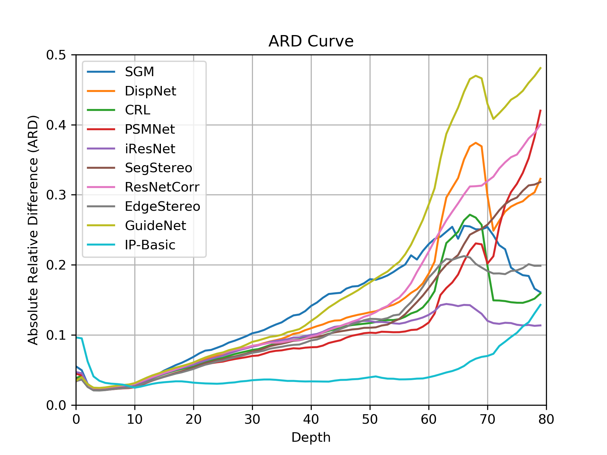
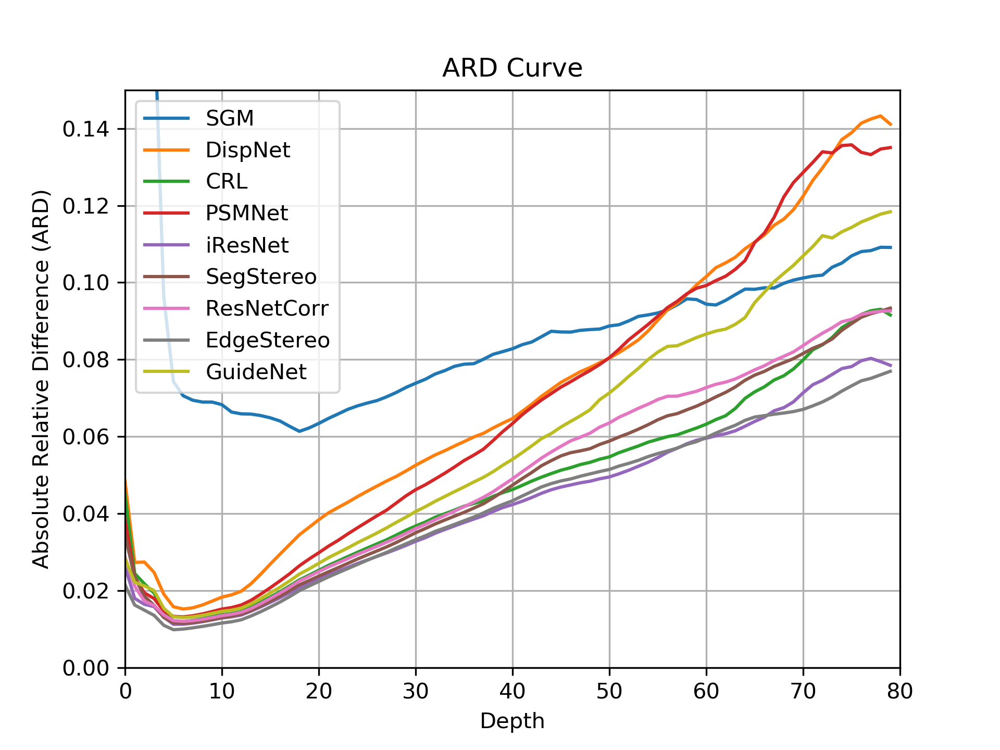
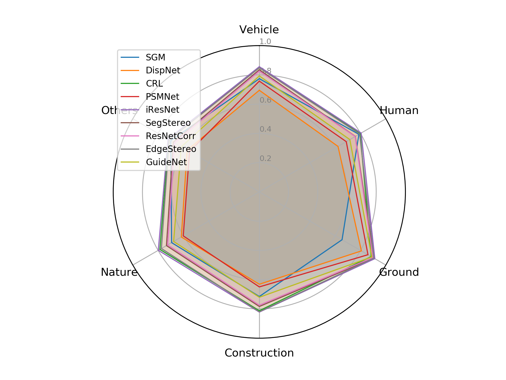
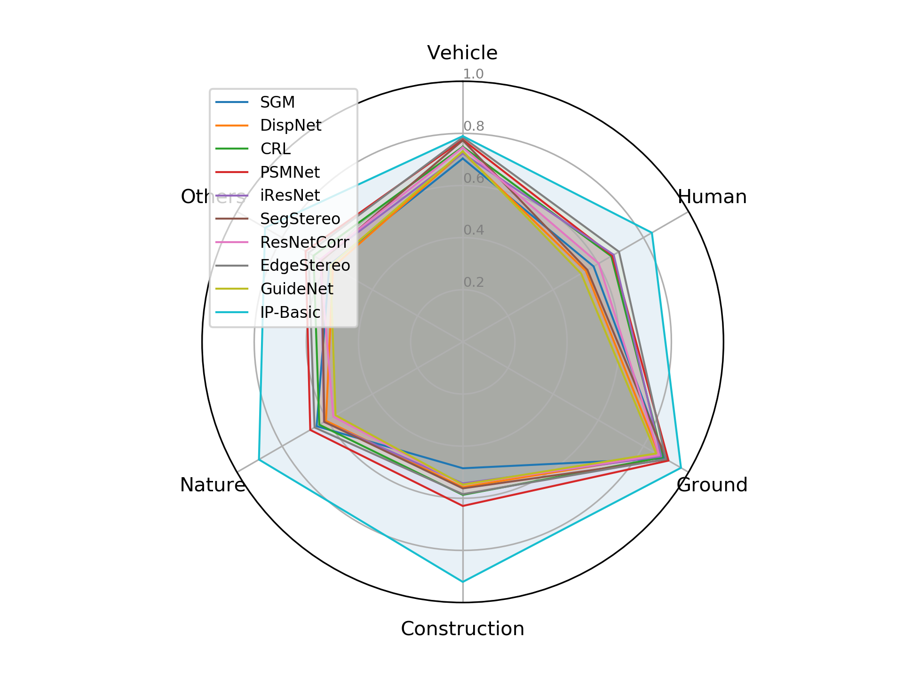

## DrivingStereo



### News

2019-06-13: &nbsp; Demo images release. [Download link](https://drive.google.com/open?id=1T_qjjtX6UvQtLsr03EtFhBz8ZIPII7WO)

2019-06-08: &nbsp; Our paper makes public on open access. [Paper link](http://openaccess.thecvf.com/content_CVPR_2019/papers/Yang_DrivingStereo_A_Large-Scale_Dataset_for_Stereo_Matching_in_Autonomous_Driving_CVPR_2019_paper.pdf)

2019-05-04: &nbsp; Demo video is uploaded to youtube. [Video Link](https://www.youtube.com/watch?v=LzRSfs6oaCA)

### Authors

Guorun Yang, Xiao Song, Chaoqing Huang, Zhidong Deng, Jianping Shi, Bolei Zhou

### Introduction

In this work, we construct a large-scale stereo dataset named DrivingStereo. It contains over 180k images covering a diverse set of driving scenarios, which is hundreds of times larger than the KITTI stereo dataset. High-quality labels of disparity are produced by a model-guided filtering strategy from multi-frame LiDAR points. Compared with other dataset, the deep-learning models trained on our DrivingStereo achieve higher generalization accuracy in real-world driving scenes.

### Dataset Overview

### Advantages of DrivingStereo

#### Real-Scenes 

The data is collected from real driving scenes.

#### High Diversity

DrivingStereo dataset covers diverse road scenarios and different weathers. 

#### Large Amount of Data

The total number of frames in DrivingStereo is more than 180K. Among them, 174,437 frames are splited as training set, and the remaining 7,751 frames are splited as test set. 

#### High-quality labels

The disparity labels in our dataset are projected from LiDAR points and filtered by a novel model-guided strategy.

### Results

<!--  -->
<!--  -->
 

<!--  -->
<!--  -->

### Contact 

yangguorun91@gmail.com, songxiao@sensetime.com

