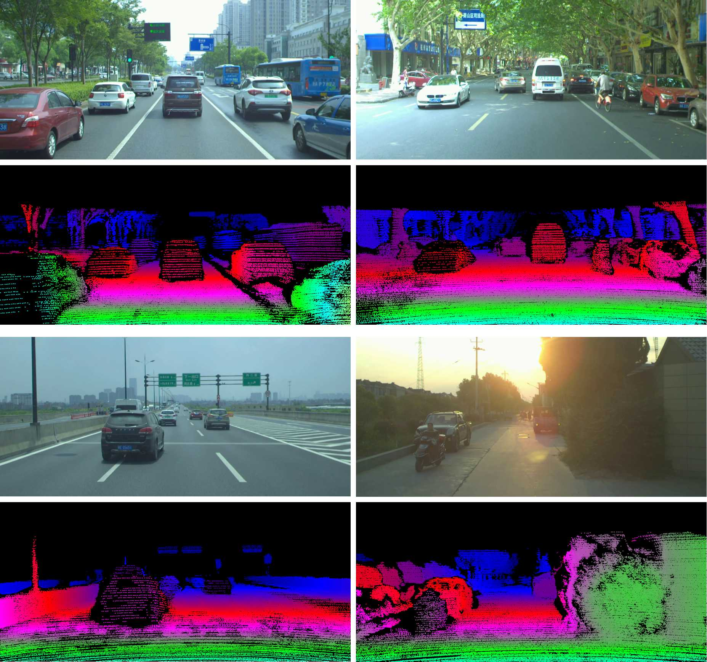

## DrivingStereo



### News

2019-11-10: &nbsp; Training dataset releases.

2019-06-13: &nbsp; Demo images release. [Download link](https://drive.google.com/open?id=1T_qjjtX6UvQtLsr03EtFhBz8ZIPII7WO)

2019-06-08: &nbsp; Our paper makes public on open access. [Paper link](http://openaccess.thecvf.com/content_CVPR_2019/papers/Yang_DrivingStereo_A_Large-Scale_Dataset_for_Stereo_Matching_in_Autonomous_Driving_CVPR_2019_paper.pdf)

2019-05-04: &nbsp; Demo video is uploaded to youtube. [Video Link](https://www.youtube.com/watch?v=LzRSfs6oaCA)

### Download

We provide **Google Drive** and **Baidu Cloud** links for the downloading of left images, right images, and disparity maps. In order to compress data for convenience, all of the images are downsampled to the half resolution. The average resolution of image is 881x400. The total number of our dataset is 182188, where the training set has 174,437 pairs and the testing set has 7751 pairs.

As KITTI stereo dataset, our disparity maps are saved as **uint16 PNG images**. The disparity value for each pixel can be computed by converting the uint16 value to float and dividing it by 256. The zero values indicate the invalid pixels.

#### Training data

|    Data Type   | Google Drive | Baidu Cloud |
|  :----------:  | :----------: | :---------: |
|  Left images   | [*Download Link*](https://drive.google.com/drive/folders/1KN8BSF5KovPuNpKf0W2hScVpo70bRewI?usp=sharing) | [*Download Link*](https://pan.baidu.com/s/4n2qpSY9) |
|  Right Images  | [*Download Link*](https://drive.google.com/drive/folders/1UG1U6iZVKsSk3Amn84bE1iFN53OKlsps?usp=sharing) | [*Download Link*](https://pan.baidu.com/s/4jMOLnDW) |
| Disparity Maps | [*Download Link*](https://drive.google.com/drive/folders/18obNjqFMzPuga6ZLN4UwCAqUjP7tQlKg?usp=sharing) | [*Download Link*](https://pan.baidu.com/s/4stUt7uX) |

<!-- #### Testing Sequences

|    Data Type   | Google Drive | Baidu Cloud |
|  :----------:  | :----------: | :---------: |
|  Left images   | Uploading | Uploading |
|  Right Images  | Uploading | Uploading |
| Disparity Maps | Uploading | Uploading | -->

### Overview

We construct a large-scale stereo dataset named DrivingStereo. It contains over 180k images covering a diverse set of driving scenarios, which is hundreds of times larger than the KITTI stereo dataset. High-quality labels of disparity are produced by a model-guided filtering strategy from multi-frame LiDAR points. Compared with other dataset, the deep-learning models trained on our DrivingStereo achieve higher generalization accuracy in real-world driving scenes. The details of our dataset are described in [our paper](http://openaccess.thecvf.com/content_CVPR_2019/papers/Yang_DrivingStereo_A_Large-Scale_Dataset_for_Stereo_Matching_in_Autonomous_Driving_CVPR_2019_paper.pdf).



### Authors

Guorun Yang, Xiao Song, Chaoqing Huang, Zhidong Deng, Jianping Shi, Bolei Zhou

### Contact

yangguorun91@gmail.com, songxiao@sensetime.com

### Citation

If you use our DrivingStereo dataset in your research, please cite this publication:
```
@INPROCEEDINGS{yang2019drivingstereo
    title={DrivingStereo: A Large-Scale Dataset for Stereo Matching in Autonomous Driving Scenarios},
    author={Yang, Guorun and Song, Xiao and Huang, Chaoqin and Deng, Zhidong and Shi, Jianping and Zhou, Bolei},
    booktitle={IEEE Conference on Computer Vision and Pattern Recognition (CVPR)},
    year={2019}
}
```
